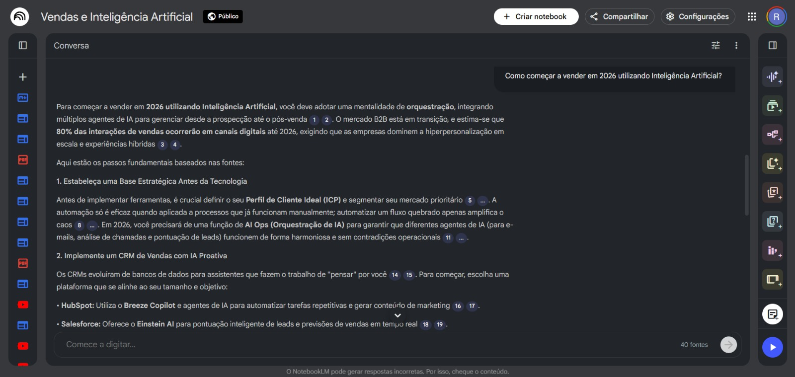

# 💼 SalesAI – Especialista em Vendas com IA (NotebookLM)

Projeto desenvolvido no curso **GenAI & Dados (DIO)** que demonstra a criação
de um **especialista em vendas com IA generativa**, utilizando o NotebookLM (Google).

## 🎯 Objetivo
Apoiar abordagens comerciais, tratamento de objeções e treinamento de vendas
por meio de um assistente inteligente.

## 🧠 Abordagem
Uso de **Prompts** e curadoria de documentos para simular
o comportamento de um especialista em vendas.

## 🛠️ Ferramentas
- NotebookLM (Google)
- IA Generativa

## 🔗 Acesso ao Projeto
NotebookLM público para demonstração:
👉 https://notebooklm.google.com/notebook/7a103cdb-aede-4183-b84d-9b8b23d9033a

## 📸 Exemplos
  

